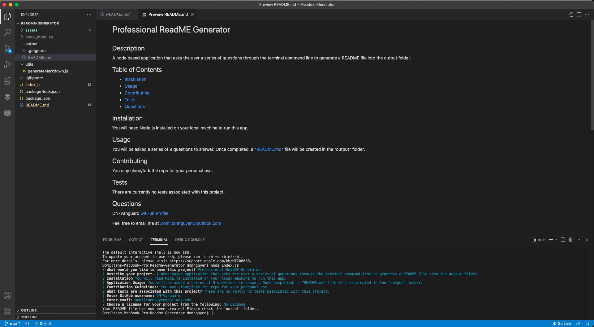

# Readme-Generator

## Description
A node based application that asks the user a series of questions through the terminal command line to generate a README file into the output folder.
README files are an important aspect of describing projects to users, and gives them a summary of what they are looking at.
Since every README file are similar to one another, I created a foundation of 9 questions of what should be on a good README file.

## Screenshot

## Walkthrough Video

## Example Generated README.md
https://drive.google.com/file/d/132Khdc3ODkrzjqRmmymW4hVztzB3UN5S/view?usp=sharing

## Installation
You will need Node.js installed on your local machine to run this app.
Before use, run the line of code `npm install` or `npm i` (for short) in terminal to load any dependencies such as 'Inquirer' to the folder.
